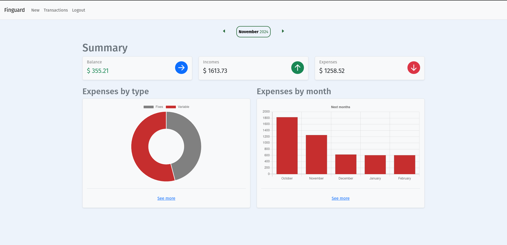
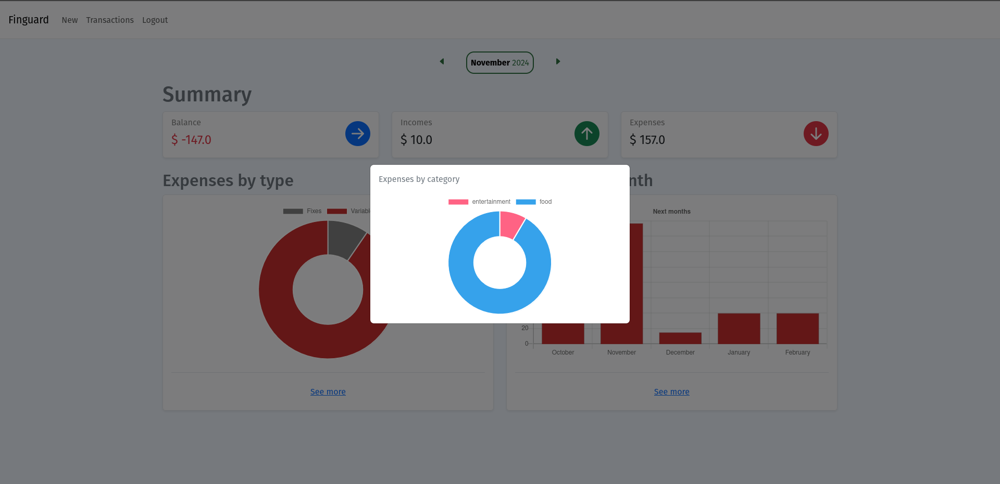
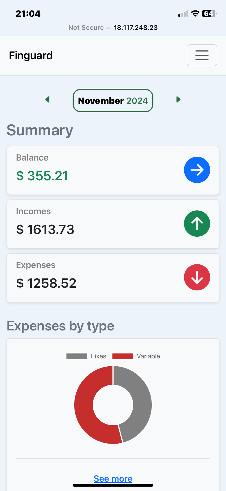
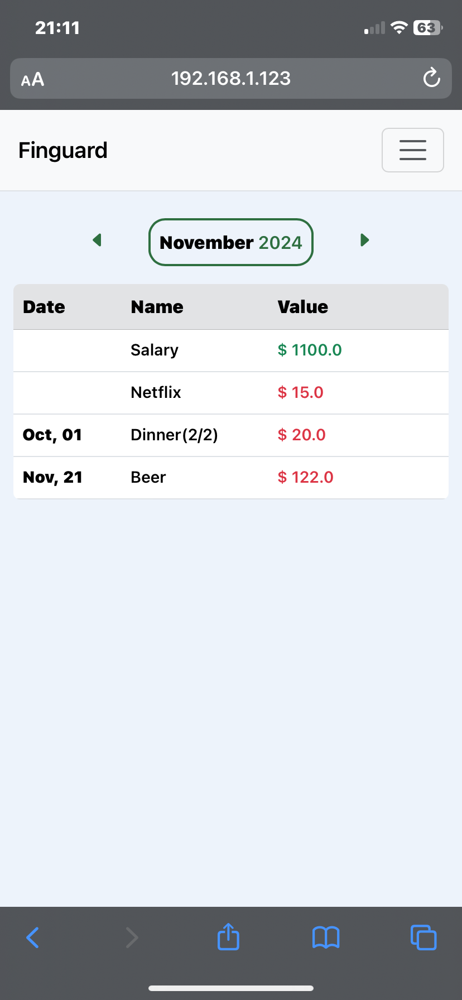

# Finguard # 

App to monitore personal incomes and expenses

**Tecnologys and Frameworks**
-
- Django
- PostgreSQL
- Some Bootstrap 5 

**How to Run**
-
Clone this repository by using,
    
    git clone https://github.com/gustavogomesn/finguard.git

Make sure you have requirements installed. You can use the following command to install,

    pip install -r requirements.txt
    
Now, open terminal/command prompt in the finguard folder and run the manage.py file by using the following commands,

    python3 manage.py collectstatic # With debug mode disabled, this command is necessary to load external js and css.
    python3 manage.py runserver

Probably you will obtain "Key Errors" when load enviroment variables, you will need to set in your enviroment:

DJANGO_SECRET_KEY: Secret Key to your Django sessions  
SUPABASE_USER: User of your Postgres database  
SUPABASE_PASSWORD: Password of your Postgres database  
SUPABASE_HOST: Host of your Postgres database  
SUPABASE_PORT: Port that your Postgres database is running  
SMTP_HOST: Host of yout SMTP server mail(This is necessary to reset passoword of users)  
SMTP_PORT=: Port of yout SMTP server mail  
SMTP_HOST_USER: User of yout SMTP server mail  
SMTP_HOST_PASSWORD: Password of yout SMTP server mail  

## Images ##

